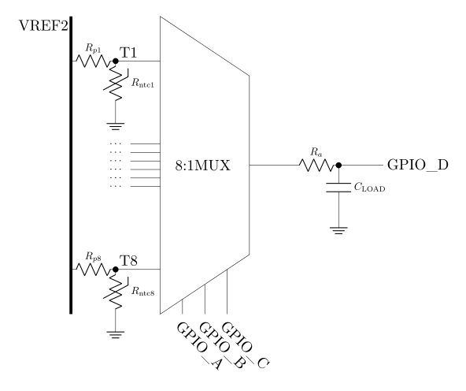

# BMS

This repo contains the code for the AMS (`G474Re-BMS/`), for a GUI that monitors the AMS output in its USB CN1 connector (`Monitor/`), and for a Renode-based simulation (`simulation/`).

[//]: # (See https://stackoverflow.com/a/33433098)

1. [Scripts](#scripts)
    1. [Linux](#scripts-linux)
    1. [Windows](#scripts-windows)
1. [Architecture](#architecture)
1. [ADBMS6830B](#adbms6830b)
    1. [Cell balancing](#adbms6830b-cell-balancing)
    1. [Sleep-like states](#adbms6830b-sleep-like-states)
    1. [Setup](#adbms6830b-setup)
    1. [Loop](#adbms6830b-loop)
    1. [To be considered](#adbms6830b-to-be-considered)
1. [Nucleo-G474Re](#nucleo-g474re)
    1. [Nucleo-G474Re to PC communication protocol](#protocol)
1. [Contributing](#contributing)
    1. [Building](#building)
    1. [Git Hooks](#git-hooks)

---

# Scripts <a name="scripts"></a>

### Scripts > Linux <a name="scripts-linux"></a>

```bash
./build.sh [--clean|--clear]
./upload.sh [flags in build script] [--debug]
./simulate.sh [--clean|--clear] [--nuke] [--renode-stderr]
Monitor/renode.sh
```

### Scripts > Windows <a name="scripts-windows"></a>

```bash
build [--clean|--clear]
upload [flags in build script] [--debug]
simulate [--clean|--clear] [--renode-stderr]
Monitor\renode
```

---

# Architecture <a name="architecture"></a>

- 7 daisy-chained [ADBMS6830B](https://www.analog.com/media/en/technical-documentation/data-sheets/adbms6830b.pdf)
- [ADBMS6822](https://www.analog.com/media/en/technical-documentation/data-sheets/adbms6821-adbms6822.pdf)
- [TMUX1208](https://www.ti.com/lit/ds/symlink/tmux1208.pdf)
- Nucleo-G474Re
    - Most of the code is in *G474Re-BMS/Core/Inc/bms/* and *G474Re-BMS/Core/Src/bms/*. The rest of the code is mainly
      generated from CubeMX.

---

# ADBMS6830B <a name="adbms6830b"></a>

See [Data Sheet](https://www.analog.com/media/en/technical-documentation/data-sheets/adbms6830b.pdf) Rev. 0 page 15/83.
Every mention of a term in the Data Sheet will be in a block (`example`) so that it is easily _Ctrl+F_-able.

The maximum data rate is 2Mbps (`SERIAL INTERFACE OVERVIEW`).

Each ADBMS6830B reads voltages of the cells with the `Cell Voltage ADC`s and measures their temperature with the GPIO
pins using thermistors, as shown in the following diagram ([view as PDF](Docs/bms_temp_mux.pdf)).\
For each ADBMS6830B, we have 3 MUXes, where the selector pins are **GPIO1**, **GPIO2** and **GPIO6** for all of them.
The data pins are **GPIO7**, **GPIO8** and **GPIO9** for the outputs of the three MUXes.
The last ADBMS6830B only has 1 MUX, where the data pin is **GPIO7**.
<p align="center">
    
</p>

Before taking a measurement, it is needed to wait a settling time. See
[this settling time tutorial by Analog Devices](https://www.analog.com/media/en/technical-documentation/app-notes/an-1024.pdf),
and
[this calculator by Analog Devices](https://www.analog.com/en/resources/interactive-design-tools/settle-switches.html)
where the following formulas are explained (where $b$ is the number of bits that determine the resolution of the
floating-point reading).

``` math
\begin{align}
E &\equiv&& \text{LSB (\%FS)} &&≔ \frac{100}{2^b} \\
t_{RC} &\equiv&& N_\text{time constants} &&≔ -\ln\left(\frac{E}{100}\right) \\
& && t_\text{settle} &&≔ T_\text{transition} + \left(\left[ R_\text{ON} \parallel R_\text{LOAD} \right] \cdot C_\text{ON} \cdot t_{RC}\right) 
\end{align}
```

where $\parallel$ is [the parallel operator](https://en.wikipedia.org/wiki/Parallel_(operator)). $R_\text{ON}$
and $C_\text{ON}$ are the resistance and capacitance from the selected data pin to the output pin respectively.

In our case, we don't have any resistor from the output pin to ground, so ${R_\text{LOAD} = \infty}$ but we do have a
capacitor from the output pin to ground, so ${C_\text{ON} = C_D + C_\text{LOAD}}$, where $C_D$ is the internal
capacitance of the MUX.\
Additionally, we have multiple resistors from the source of voltage to the final output,
so ${R_\text{ON} = \left(R_p \parallel R_{\text{ntc}}\right) + R_D + R_a}$ where $R_D$ is the internal resistance of
the MUX.

$R_D$, $C_D$ and $T_\text{transition}$ can be found on
[the MUX's Data sheet]((https://www.ti.com/lit/ds/symlink/tmux1208.pdf)).\
$R_p$, $R_{\text{ntc}}$, $R_a$ and $C_a$ are part of our circuit.\
$b$ is chosen by us.

### ADBMS6830B > Cell balancing <a name="adbms6830b-cell-balancing"></a>

> [!CAUTION]
> TODO This will probably change. This is just for testing purposes
>
> We set the `PWM` duty cycle to 0% so that there is NO CELL BALANCING, meaning some cells will discharge faster than
> others and the ADBMS8630Bs will NOT try to compensate for it. A duty cycle of 100% would discharge some cells and
> dissipate the current as heap to bring lower their voltage closer to their neighbors.

### ADBMS6830B > Sleep-like states <a name="adbms6830b-sleep-like-states"></a>

At first `power-up` or after a `power-on reset` the device enters the `Standby State`. After
`WATCHDOG OR DISCHARGE TIMER` (aka `tSLEEP`secs) any state will got to either the to the `Sleep State` or the
`Extended Balancing and DTM Measure States`, depending on whether `DCTO` is set to 0 or 1, respectively.\
To go from the `Sleep State` to the `Standby State`, it must be sent a `wake-up signal` and a delay of `tWAKE`us.

At the same time, the isoSPI ports go from the `Ready State` to the `Idle State` after `tIDLE`ms of inactivity.\
To go from the `Idle State` to the `Ready State`, it must be sent a `wake-up signal` and a delay of `tWAKE`us if the
device is in the `Sleep State` or `tREADY`us if the device is in the `Standby State`.

At the end of the day, this means that a `wake-up signal` must be sent after almost every ***HAL_Delay***, since `tIDLE`
can time out after a mere 4.3ms. The device can be wakened up by toggling the Chip Select every `tDWELL`ns up and down
for each daisy-chained ADBMS6830B (see `Waking Up the Serial Interface` and
`Figure 32. Wake-Up Detection and Idle Timer`). Both the waits in between the CS-toggling of the `wake-up signal` and
the `tDWELL`/`tWAKE`/`tREADY` wait are way under a single ms, but we still ***HAL_Delay(1)*** since is the most
convenient and provides enough precision for our needs.

### ADBMS6830B > Setup <a name="adbms6830b-setup"></a>

- Send a `wake-up signal` and wait `tWAKE`us.
- Configure the registers.
    - Set `REFON` = 1 so that if for any reason we end up in the `REFUP State`, we won't need to wait another `tREFUP`
      ms. In theory, the `REFUP State` is not reachable, since we will set _`CONT` = 1_, so this can be ignored.
    - Set `DCTO` = 63 (u6::MAX) and `DTRNG` = 1 so that we end up in the `Extended Balancing` state for 16.8 hours
      instead of going directly to the `Sleep State` upon `watchdog timeout` (i.e. after `tSLEEP` secs). In this state,
      if we were still measuring `CONT`-inuously and `DTMEN` is set to 1, then it will not stop them; however, they will
      only be done each 30s (`DISCHARGE TIMER MONITOR`). // TODO page 39
    - Set `DTMEN` = 1, as explained above. // TODO Test what happens if I send some READ command while in
      `Extended Balancing` state: does it really go to the `Standby State` or to the `Measure State`
- Send an `ADC command` (pages 19-20) and wait `tREFUP`ms to go to the `Measure State`.
    - Set _`CONT` = 1_.
    - Only use the `C-ADCs` with the `ADCV` command, not the `S-ADCs`. // TODO should we use the `S-ADCs` for
      `CELL OPEN WIRE DETECTION` (pages 21 and 24)?

### ADBMS6830B > Loop <a name="adbms6830b-loop"></a>

The readings are not performed with `RDACALL` nor other similar commands, since they are
`for single IC applications only` (i.e. not available for daisy-chained devices). See `READ ALL AND SNAPSHOT COMMANDS`,
`READ ALL COMMANDS` and `SNAPSHOT COMMANDS`.

Repeat the following at 500ms intervals (not with a 500ms delay between them):

- Send a `wake-up signal` and wait `tWAKE`us.
- `SNAP` measurements.
- Read all average voltages with `RDACA`, `RDACB`, `RDACC`, `RDACD`, `RDACE` and `RDACF`.
- `UNSNAP` measurements.
- Send a voltage-message to the PC. See [the protocol](#protocol).
- Read all temperatures (**temp-loop**).
    - Write GPIOs to select the correct channel to be multiplexed via the `WRCFGA` command (**GPIO1**, **GPIO2** and
      **GPIO6** pins).
    - Wait $t_\text{settle}$ ms (not in Data Sheet, but this file).
    - Send `AUX ADC measurement` commands (page 23). // TODO `SOAKON`
    - Wait until the measurement is done by polling the `PLAUX` command. About the output of `PLAUX`:
      `The SDO status is valid only at the end of 2 × N clock pulses on SCK`.
    - Read all temperatures with `RDAUXC` (**GPIO7**, **GPIO8** and **GPIO9** pins).
- Send temperature-message to the PC. See [the protocol](#protocol).

### ADBMS6830B > To be considered <a name="adbms6830b-to-be-considered"></a>

- `AUX ADC OPERATION AND COMMANDS`
- `CELL OPEN WIRE DETECTION`
- `LOW POWER CELL MONITORING`
- `COMMUNICATION DIAGNOSTIC AND REPORTING` and `SPIFLT`

---

# Nucleo-G474Re <a name="nucleo-g474re"></a>

### Nucleo-G474Re > Nucleo-G474Re to PC communication protocol <a name="protocol"></a>

- The Nucleo-G474Re sends to the PC a message via USB periodically.
- The first bit (**MSB**) of the message states whether it is a data-message or a print-message/debug-message.
    - If **MSB = 0**, it is a data-message.
        - The next bit, **data_type**, states whether it is a voltage-message or a temperature-message.
        - The next 30 bits are an u30 (little endian) with the timestamp
        - The message contains 7 readings, one for each daisy-chained ADBMS6830B (can be configured in
          *G474Re-BMS/Core/Inc/bms/config.h*).
        - If **data_type = 0**, it is a voltage-message.
            - Each reading has 16 raw-voltages ($V_\text{raw}$), each of which is an i16 (little endian).
            - The actual voltages can be computed with the following formula, obtained from
              `Table 104. Result Registers Bit Descriptions` and `Table 107. Register Format Overview`:
              ${V = \text{float}\left(V_\text{raw}\right) \cdot \frac{150}{10^6} + 1.5}$
        - If **data_type = 1**, it is a temperature-message.
            - Each reading has ${3 \cdot 8}$ raw-temperatures ($T_\text{raw}$), except the last one which has
              ${1 \cdot 8}$. Each raw-temperature is an i16 (little endian). The number 3 is the number of MUXes per
              ADBMS, except the last one which only has 1, and the number 8 is the channels of the MUXes, all of which
              can be configured in *G474Re-BMS/Core/Inc/bms/config.h*.
            - The actual voltages can be computed with the following formula, obtained from
              `Table 104. Result Registers Bit Descriptions` and `Table 107. Register Format Overview`:
              ${T = \text{float}\left(T_\text{raw}\right) \cdot \frac{150}{10^6} + 1.5}$
    - If **MSB = 1**, it is a print-message/debug-message.
        - The message only contains a UTF-8 length-prefixed string.
        - The length is encoded similarly to LEB128 (little endian Varint), but the first group will be an u7 instead of
          an u8 (since the first bit was already used to determine that this is a print-message/debug-message).

---

# Contributing <a name="contributing"></a>

### Contributing > Building <a name="building"></a>

This is a normal CMake project, so feel free to compile it with CLion (or any IDE of your choosing) or with the CMake
CLI. We recommend installing [CubeCLT](https://www.st.com/en/development-tools/stm32cubeclt.html), which comes with a
toolset with *arm-none-abi-gcc*, a debugger and so on.

We provide `./build.sh` as an auto-config+compile tool. Linux is NOT needed to run it, it can be ran from the Git Bash.

```bash
./build.sh
```

### Contributing > Git Hooks <a name="git-hooks"></a>

```bash
cat > .git/hooks/pre-commit <<'EOF'
#!/usr/bin/env bash
set -euo pipefail
./build.sh 2>/dev/null >&2 || (
  ERR=$?
  echo "Build failed! Aborting commit..."
  ./build.sh 2>/dev/null # Rebuild to show the err msg again
  exit $ERR # just in case...
)
EOF
chmod +x .git/hooks/pre-commit
```
